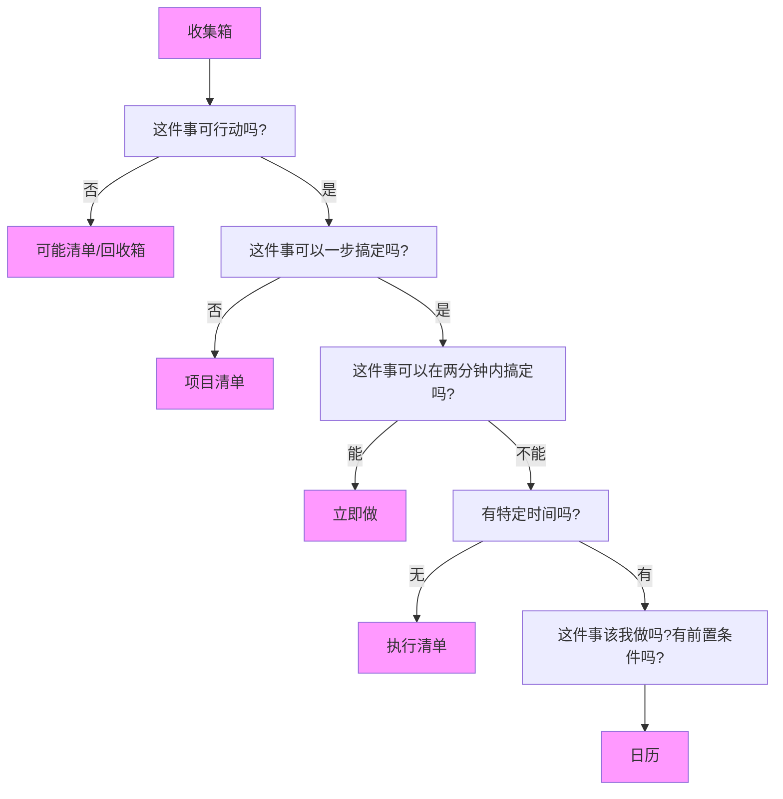

GTD的核心思想是收集事务，明晰事务，执行事务，归档事务。

# 收集事务

收集的事务我分为几个类：

1. 待办
2. 短期目标和长期目标
3. 突发的灵感和计划
4. 剪藏内容

对于上述这样的内容，很容易被记录，但我需要全平台同步，不知道印象笔记每月60M的流量是否足够。

# 明晰事务

明晰事务是对收集事务的进一步处理，按照GTD给的清单对各项内容进行归类。

1. 可能清单：可能会做的事，也可能永远不会做的事，目前来说不重要也不紧急，如：学一门新的编程语言
2. 项目清单：事务重要做也很急事务，并且不是一步就能做成的，需要进一步处理。如：毕业论文，考研等
3. 等待清单：需等待时机成熟或持续跟进。如果这件事情你并不是非做不可，而且可以分配给其他人来做，这种事就需要一个单独的分区，叫做等待清单（“Wait for" task）。你不需要做，但你需要跟进。
4. 执行清单：这是目前最重要最紧急，已经处理得不需要其它步骤一步执行得清单，只需要做就是了。
5. 回收箱：暂时搁置或者丢弃得事务。因为一件事本身会不断变化。
6. 日历：对于有特定日期得事务。

# 执行事务

就是按照执行清单上得任务一个一个做，其中提到了几个注意点：

1. 能被放进执行清单的，都是可以一步搞定的；
2. 做计划、做方案是每个人的必修课：“怎么做” 是方法和技巧，“为什么？”、“怎么来的” 才和计划、方案有更紧密的联系；
3. 做好时间预估
4. 为特别的事件预留时间

如果用时较长，可能是事情本身非常特殊，能力有问题，态度有问题。

## 如何保障执行清单的质量和效率？

1. 一次只处理一件事情
2. 使用番茄时钟提高效率
3. 打破 “负罪感幻觉”

# 应用选择原则

1. 没有100%契合任何人的应用，放弃一劳永逸
2. 尽量参考官方推荐，总有其道理
3. 考虑迁移成本
4. 考虑你的硬件设备，全平台不一定好
5. 给自己足够时间试错
6. 不是软件能帮你做什么，而是你如何使用软件
7. 便利≠高效，不要舍本逐末

# 归档事务

归档分为几个部分：

1. 对人生哲学写latex文档，利用git同步到云端。
2. 对当日需要回顾的内容加深记忆。
3. 对剪藏的零碎内容进行整理。

